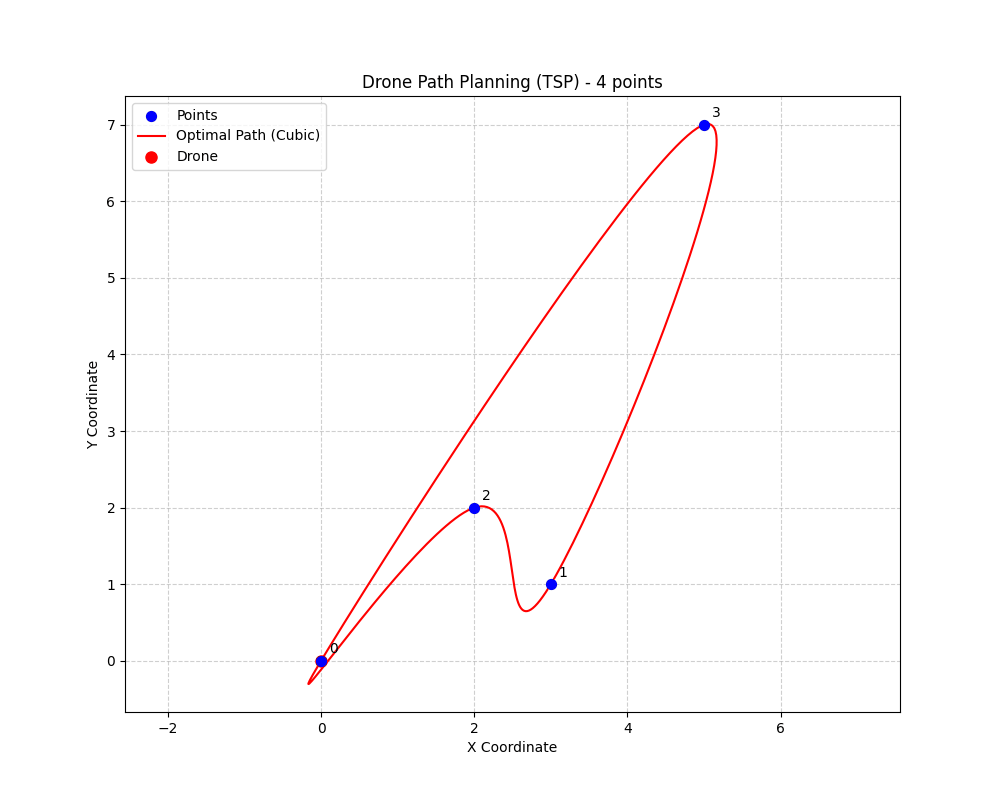

# Quantum Drone Path-Planning with Qibo

This project demonstrates a quantum algorithm for drone path-planning using the Qibo quantum computing framework. The core logic is implemented in Python and leverages quantum optimization techniques to solve a simplified version of the Traveling Salesman Problem (TSP).

## Project Structure

- `src/main.py`: Entry point. Loads points from CSV, runs the quantum algorithm, and visualizes the result.
- `src/services/path_planning_service.py`: Implements `PathPlanningService` for quantum optimization logic.
- `src/points.csv`: Sample input file with x,y coordinates.
- `docs/`: Project documentation and API reference.
- `requirements.txt`: Python dependencies.

## GPU Support

This project now supports GPU execution via Qibo's CUDA backend. Ensure you have:
 1. A CUDA-compatible GPU.
 2. NVIDIA CUDA toolkit installed.
 3. Installed dependencies via `pip install -r requirements.txt`.

## How It Works

1. **Define Points**: Specify a list of (x, y) coordinates representing locations the drone must visit.
2. **Quantum Optimization**: The service encodes the TSP as a quantum Hamiltonian and uses QAOA (Quantum Approximate Optimization Algorithm) to find an optimal path.
3. **Visualization**: The resulting path is plotted on a 2D map.

## Usage

1. Install dependencies:
   ```bash
   pip install -r requirements.txt
   ```

2. Prepare input points:
   - Edit `points.csv` or supply a custom CSV file with `x,y` headers.

3. Run the main script:
   ```bash
   python main.py
   ```

4. Customize QAOA and service parameters in `main.py`:
   ```python
   service = PathPlanningService(
       depth=3,
       optimizer="COBYLA",
       penalty_weight=0.1,
       precision="float32",
       gate_fusion=True,
       devices=[0],  # GPU device indices
       seed=123
   )
   ```

## Customization
- **Input Points**: Modify `points.csv` or implement your own loader via `load_points_from_csv`.
- **QAOA Parameters**: Adjust `depth`, `optimizer`, and `penalty_weight`, as well as `precision`, `gate_fusion`, `devices`, and `seed` when creating the service.

## Clean Code Improvements
- Clear and descriptive names for classes, methods, and variables.
- Comprehensive docstrings for all public and private methods.
- Input validation and error handling throughout the code.
- Configurable QAOA parameters (depth, optimizer).
- Separation of concerns: quantum logic in the service, visualization in `main.py`.
- Example usage and visualization included.

## Limitations
- The TSP Hamiltonian is a simplified placeholder. For real-world use, a full QUBO/Ising encoding is needed.
- The decoding from quantum output to path is not fully implemented (returns a trivial path).

## Example Output
Below is an example animation of the drone path planning:



---

## Tests
To validate the functionality of the project, run the automated tests with:
```bash
pytest
```

- **test_launch_plot_only.py**: Verifies the `--plot-only` option.
- **test_plot_path.py**: Checks the path plotting logic.

---

## License

This project is licensed under the MIT License.
